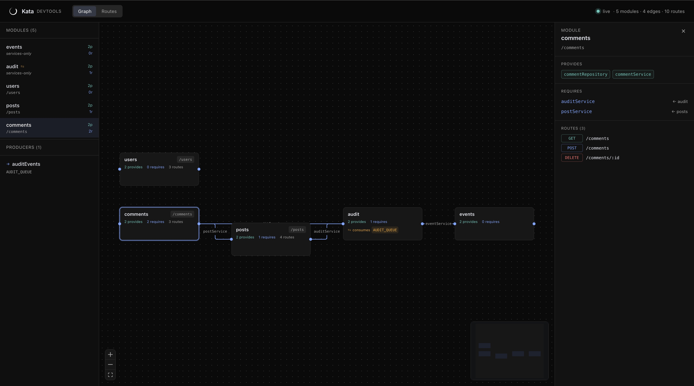

<div align="center">
  

  # Kata

  **The opinionated Hono framework for Cloudflare's full stack.**
</div>

> An opinionated framework for [Hono](https://hono.dev) on [Cloudflare Workers](https://developers.cloudflare.com/workers/), distributed under the `@katajs/*` scope on npm.

Kata is a thin wiring layer that gives you modules, request-scoped DI, typed validation, transactions, queue producers and consumers, and a live devtools graph on top of tools you already know. It doesn't replace Hono, Zod, or Drizzle — it composes them into one shape so every project starts the same way.

---

## Quickstart

```bash
pnpm create katajs my-app
cd my-app
pnpm install
pnpm dev
```

That gives you a Worker with one example `posts` module, Drizzle + Hyperdrive wired up, validation, error mapping, and a `/health` route. Open `http://localhost:8787/health`.

Add flags to scaffold richer shapes:

```bash
pnpm create katajs my-app --auth                  # Better Auth integration
pnpm create katajs my-monorepo --monorepo         # apps/* + packages/* layout
pnpm create katajs my-monorepo --monorepo --auth  # both
pnpm create katajs my-monorepo --monorepo --worker # also: sibling queue Worker
```

Once you're in a project, the `katajs` CLI ships mutators that keep wiring in sync as you grow:

```bash
katajs add module billing      # new module + Registry + app.ts + graph
katajs add service stripe --in billing
katajs add route POST /webhook --in billing
katajs add queue invoices      # consumer module + producer manifest
```

---

## What your code looks like

A module declares what services it owns (`provides`), what services it needs from elsewhere (`requires`), and its routes:

```ts
// src/modules/posts/index.ts
import { defineModule } from '@katajs/core';
import { makePostService } from './posts.service';
import { makePostRepository } from './posts.repository';
import { postsRoutes } from './posts.routes';

export const postsModule = defineModule({
  name: 'posts',
  provides: {
    postRepository: (c) => makePostRepository(c.db),
    postService: (c) => makePostService(c),
  },
  requires: ['auditService'] as const,
  routes: postsRoutes,
  prefix: '/posts',
});
```

A route resolves whatever it needs from the per-request container:

```ts
// src/modules/posts/posts.routes.ts
import { Hono } from 'hono';
import { validate } from '@katajs/core';
import { CreatePostSchema } from './posts.schema';

export const postsRoutes = new Hono<AppEnv>()
  .post('/', ...validate({ body: CreatePostSchema }), async (c) => {
    const input = c.req.valid('json');
    const service = c.var.resolve('postService');
    const post = await service.create(input);
    return c.json({ post }, 201);
  });
```

`createApp` boots the Hono app, validates the module graph, and mounts everything:

```ts
// src/app.ts
const { app, queue } = createApp({
  bindings: {} as Bindings,
  db: drizzleAdapter({ schema }),
  modules: [eventsModule, auditModule, postsModule],
  queues: {
    auditEvents: { binding: 'AUDIT_QUEUE', schema: AuditEventSchema },
  },
  routes: (base) => base
    .get('/health', (c) => c.json({ ok: true }))
    .route(postsModule.prefix, postsModule.routes),
});

export default { fetch: app.fetch, queue };
export type AppType = typeof app;  // for Hono RPC
```

That's most of the framework. The rest is conventions for how modules organize files, how transactions thread through services, and how queue consumers attach to modules.

---

## Devtools

```bash
npx katajs-devtools
```

Opens a live React UI showing the module graph, dependency edges, route table, and queue producer/consumer pairs. Watches `src/modules/**` and hot-reloads on every save.



For static snapshots, `pnpm graph` produces a self-contained `graph.html` you can drop into a PR or design doc.

---

## Why does this exist?

Hono is excellent. Zod is excellent. Drizzle is excellent. But every Hono+Workers project ends up reinventing the same shapes — request context, error mapping, transaction scoping, where validation goes, how services share dependencies, where the schema lives. Kata is the version of those decisions I want to stop making twice.

It's not trying to be NestJS for Workers. It is trying to be the smallest opinionated layer that makes a Hono+Cloudflare+Drizzle project boring to start.

What it's **for**:
- Backend Workers with Postgres (Hyperdrive), validation at boundaries, RPC-typed clients.
- Projects that benefit from explicit module boundaries with explicit dependencies.
- Apps that consume or produce Cloudflare Queues and want both halves typed end-to-end.
- People who want one less decision to make at the start of every project.

What it's **not for**:
- Static sites or pure SSR — use Astro / TanStack Start.
- Multi-runtime backends — Kata is Cloudflare-first.
- Generic Hono utility kits — we ship one shape, not a buffet.

---

## What it builds on (and what it adds)

| Layer | Tool | Where Kata adds value |
|---|---|---|
| HTTP server | [Hono](https://hono.dev) | Plumbed into module routes, RPC types preserved end-to-end |
| Validation | [Zod](https://zod.dev) + [@hono/zod-validator](https://github.com/honojs/middleware/tree/main/packages/zod-validator) | `validate()` wrapper that throws typed errors |
| ORM | [Drizzle ORM](https://orm.drizzle.team) | `withTransaction` wires tx-bound services through the container |
| Postgres pool | [Hyperdrive](https://developers.cloudflare.com/hyperdrive/) + [pg](https://node-postgres.com) | Adapter is one config call |
| Async messaging | [Cloudflare Queues](https://developers.cloudflare.com/queues/) | Consumer-on-module, producer-on-app, schemas shared by import |
| Bundler | [tsup](https://tsup.egoist.dev) | n/a |
| Tests | [Vitest](https://vitest.dev) | n/a |

The runtime itself is ~1500 lines. Most of it is the module/container contract; everything else is delegated.

---

## Packages

| Package | What it is |
|---|---|
| [`@katajs/core`](./packages/core) | The runtime — `defineModule`, `createApp`, container, errors, validation, queue types, `inspectModules`. |
| [`@katajs/drizzle`](./packages/drizzle) | Drizzle + Hyperdrive Postgres adapter with `withTransaction`. |
| [`@katajs/cli`](./packages/katajs-cli) | The project-mutator CLI — `katajs add module|service|route|queue`. |
| [`@katajs/devtools`](./packages/devtools) | Live interactive module graph (`npx katajs-devtools`). |
| [`create-katajs`](./packages/cli) | The scaffolder (`pnpm create katajs`). |

---

## Docs

The full doc set lives in [`apps/docs`](./apps/docs) (Fumadocs on TanStack Start, deployable to Cloudflare Workers). The same source markdown also lives at [`docs/concepts/`](./docs/concepts/) for direct browsing on GitHub:

- [Intro](./docs/concepts/intro.md) — what Kata is and isn't
- [Modules](./docs/concepts/modules.md) — the unit of organization
- [Container](./docs/concepts/container.md) — request-scoped DI, lazy resolution
- [Registry](./docs/concepts/registry.md) — module augmentation, strict-resolve typing
- [Routes](./docs/concepts/routes.md) — how routes mount, how RPC works
- [Validation](./docs/concepts/validation.md) — Zod + `validate()` at boundaries
- [Errors](./docs/concepts/errors.md) — `AppError`, `errorMapper`, response shape
- [Transactions](./docs/concepts/transactions.md) — `withTransaction`, repository pattern
- [Testing](./docs/concepts/testing.md) — unit tests + integration tests
- [Queues](./docs/concepts/queues.md) — consumer-on-module, producer-on-app
- [Devtools](./docs/concepts/devtools.md) — `inspectModules()`, the graph script, the live UI
- [Architecture](./docs/concepts/architecture.md) — when to split modules, when to graduate to monorepo

---

## Repo layout

```
packages/
  core/        — @katajs/core
  drizzle/     — @katajs/drizzle
  cli/         — create-katajs (project scaffolder)
  katajs-cli/  — @katajs/cli (project mutator)
  devtools/    — @katajs/devtools
apps/
  docs/        — Fumadocs docs site (deployable to Cloudflare Workers)
examples/
  basic/       — minimal scaffold
  showcase/    — every feature, with real-Postgres tests
docs/
  concepts/    — explainer docs (canonical source for apps/docs/content)
```

Build and test the whole workspace:

```bash
pnpm install
pnpm typecheck
pnpm test
pnpm build
```

The showcase example tests against a real Postgres instance. See `examples/showcase/README.md` if present, otherwise: you need a local Postgres on `5432`, db `katajs_showcase_test`. Run `pnpm --filter showcase-example db:setup` then `pnpm --filter showcase-example test:pg`.

---

## Status

v0.1 — runtime, scaffolder, CLI mutators, queues, devtools (static + live), and the docs site are all in place. See [TODO.md](./TODO.md) for what's planned beyond v0.1 (multi-Worker devtools, ecosystem adapters, source-link integration).

---

## License

[MIT](./LICENSE) © Yaseer A. Okino
