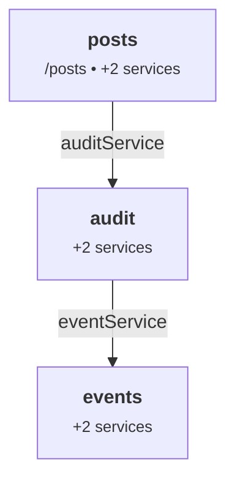

# Devtools

katajs ships two complementary devtools surfaces:

- **Shape A** — a static module-graph inspector in the runtime (`inspectModules()`). Pure, synchronous, build-time-safe. Run it as a script and get a self-contained HTML snapshot.
- **Shape B** — a live interactive web UI in `@katajs/devtools`. Run `npx katajs-devtools` and get a graph canvas, module drawer, routes table, and Cmd+K palette in your browser, hot-reloading as you edit code.

Both share the same `Inspection` data contract from `@katajs/core`, so anything you can render in Shape A you can navigate interactively in Shape B.

## Shape A — static snapshot

```ts
import { inspectModules } from '@katajs/core';
import { postsModule } from '../src/modules/posts/index';
import { eventsModule } from '../src/modules/events/index';
import { auditModule } from '../src/modules/audit/index';

const insp = inspectModules([postsModule, eventsModule, auditModule]);

console.log(insp.modules);  // GraphModule[]
console.log(insp.edges);    // GraphEdge[]
console.log(insp.routes);   // GraphRoute[]
console.log(insp.mermaid()); // string — `graph TD ...`
console.log(insp.json());    // pretty-printed JSON
console.log(insp.html());    // full standalone HTML page
```

Pure, synchronous, build-time-safe. Runs in any Node-compatible environment — no Wrangler, no DB, no HTTP server.

## The shape of the data

Three arrays, each with a stable shape:

```ts
type GraphModule = {
  name: string;
  provides: string[];
  requires: string[];
  prefix?: string;       // present for routed modules
  hasRoutes: boolean;
};

type GraphEdge = {
  from: string;          // requiring module name
  to: string;            // providing module name
  via: string;           // the service key
};

type GraphRoute = {
  method: string;        // GET, POST, ...
  path: string;          // mounted at the module's prefix
  module: string;        // owning module name
};
```

The edges are computed by walking each module's `requires` array, looking up which other module `provides` that key, and emitting `from → to via key`. Self-edges (a module requiring something it also provides) are filtered out.

The route list dedupes Hono's internal entries — Hono's `app.routes` includes one entry per middleware in a route's chain (validators + handler), but the inspector reports each user-visible route once.

## The `pnpm graph` script

The scaffolder generates two files. `scripts/modules.ts` is the canonical source of truth for the module tuple — both `pnpm graph` and `katajs-devtools` import from it:

```ts
// scripts/modules.ts (generated)
import { postsModule } from '../src/modules/posts/index';
// katajs:graph-imports

export const modules = [
  postsModule,
  // katajs:graph-modules
];
```

```ts
// scripts/graph.ts (generated)
import { writeFileSync } from 'node:fs';
import { resolve } from 'node:path';
import { fileURLToPath } from 'node:url';
import { inspectModules } from '@katajs/core';

import { modules } from './modules';

const here = fileURLToPath(new URL('.', import.meta.url));
const out = resolve(here, '..', 'graph.html');

const insp = inspectModules(modules);
writeFileSync(out, insp.html({ title: 'my-app — module graph' }));
```

```jsonc
// package.json
"scripts": {
  "graph": "tsx scripts/graph.ts"
}
```

Run it whenever you want to refresh the snapshot:

```bash
pnpm graph
# ✓ wrote graph.html
#   5 modules • 4 dependencies • 9 routes
open graph.html
```

`katajs add module` updates `scripts/modules.ts` automatically (the `// katajs:graph-imports` and `// katajs:graph-modules` anchors), so both the snapshot and the live devtools stay in sync as your app grows.

## What the HTML page looks like

The HTML includes:

- **Module graph** — a Mermaid `graph TD` rendered with dark theme. Each module is a node with its prefix and service count; edges are labeled with the service key being depended on.
- **Modules table** — name, prefix, provides (green pills), requires (blue pills).
- **Routes table** — method (color-coded), path (with module prefix merged), and owning module.

The page is self-contained — single HTML file, Mermaid loaded from a CDN. No build step. Open it in a browser, save it as a docs artifact, paste it into a Slack DM, whatever.

## Embedding the Mermaid graph elsewhere

`insp.mermaid()` returns the raw Mermaid source — useful for embedding in markdown docs (GitHub renders Mermaid natively in fenced code blocks):

````md

````

This is what makes graphing an architecture diagram a one-line script in a katajs project. Add it to your README or your design docs.

## Use cases

- **Reading a new module's deps quickly.** Run `pnpm graph` after pulling a branch — what cross-module dependencies were added?
- **Catching accidental coupling.** A leaf utility module with `requires: ['userService']` is suspicious; the graph makes it visible.
- **Onboarding.** A picture of "this is what the app looks like" beats reading a pile of `index.ts` files.
- **Design reviews.** Run `pnpm graph` on a feature branch, paste the HTML or Mermaid into the PR. "Here's the new dependency you're adding."
- **CI artifacts.** Generate `graph.html` as part of a build job; serve it from your docs site or attach it to releases.

## Shape B — live interactive devtools

`@katajs/devtools` is a dev-dependency-only package that turns the same `Inspection` data into an interactive browser UI. Install it, then run the bin from your project root:

```bash
pnpm add -D @katajs/devtools
npx katajs-devtools
#   katajs-devtools — interactive module graph
#   ➜ Local: http://127.0.0.1:4242
```

The bin imports your `scripts/modules.ts` in-process (via tsx's ESM register), runs `inspectModules()`, and serves the result over HTTP + Server-Sent Events. A chokidar watcher on `src/modules/**` and `scripts/modules.ts` re-runs the inspection on every save and pushes the new snapshot down the SSE channel — the UI hot-reloads without a refresh.

What you see:

- **Graph canvas** — React Flow with a dagre auto-layout (left-to-right, dependencies flowing right). Each module is a card showing its prefix, provides count, requires count, and route count. Click a node to highlight it across the graph and the sidebar; click empty space to deselect.
- **Module sidebar** — every module in the app, with at-a-glance provides/requires counts and a "services-only" indicator for non-routed modules.
- **Module drawer** (right side, on selection) — full provides list as accent-coloured chips, full requires list with `← provided by X` backlinks that you can click to navigate the graph, and the routes owned by the selected module.
- **Routes view** — flat table of every route with method-coloured chips, free-text filter (matches path / method / module), and per-method filter chips. Click a module name to select that module and switch back to the graph.
- **Cmd+K palette** (Ctrl+K on Linux/Windows) — fuzzy-search across modules and routes; selecting jumps to the appropriate view.

CLI flags:

```
--port <port>           default 4242 (auto-bumps if busy)
--host <host>           default 127.0.0.1
--no-open               do not auto-open the browser
--modules-file <path>   override the modules file location
```

The UI is a Vite-built React bundle served from the same Node process. No telemetry, no remote anything — entirely local.

### Data flow

```
scripts/modules.ts (your modules tuple)
        │ tsx ESM register
        ▼
inspectModules() ──────► JSON over /api/graph.sse ──────► React UI
        ▲                                                     │
        │  chokidar re-fires on src/modules/** change         │  Cmd+K, click,
        └─────────────────────────────────────────────────────┘  filter
```

The data contract is the `Inspection` shape from `@katajs/core` — exactly what Shape A produces. Anything you can render in `graph.html` is navigable in Shape B; the only difference is that Shape B keeps the graph live and connects modules together via interactive backlinks.

### When to use which

| Use case | Reach for |
|---|---|
| Snapshot for a PR / design doc / Slack | Shape A — `pnpm graph`, drag the HTML in. |
| Embed a graph in markdown / GitHub README | Shape A — `insp.mermaid()`. |
| CI artifact, build output | Shape A. |
| Explore an unfamiliar module's deps interactively | Shape B. |
| Debug "where is `userService` resolved from?" | Shape B's drawer + backlinks. |
| Edit code and watch the graph mutate | Shape B (hot reload). |

## Roadmap beyond Shape B

- **Request tracing.** Show, for a given request, which routes matched, which services resolved, which transactions opened. Needs runtime instrumentation hooks in core.
- **Schema explorer.** Drill into a module's Zod schemas with example values rendered.
- **Dependency lint.** Static rules — "leaf modules can't require service modules", "circular DB deps are forbidden" — surfaced in the UI.
- **Time-travel.** Snapshot the graph at each commit; diff between branches.
- **Source-link integration.** Click a module to jump to its `index.ts` in your editor.

These are post-1.0 ideas. Shape A and Shape B handle the immediate "see the structure" need.

## Summary

- `inspectModules(modules)` is a pure function you can call any time — at build, in a script, in a test.
- `scripts/modules.ts` is the canonical source of truth for the modules tuple; both `pnpm graph` and `katajs-devtools` import from it.
- `pnpm graph` produces a self-contained `graph.html` with a Mermaid graph + modules and routes tables.
- `npx katajs-devtools` opens an interactive React UI: graph canvas, module drawer, routes view, Cmd+K — all hot-reloading as you edit.
