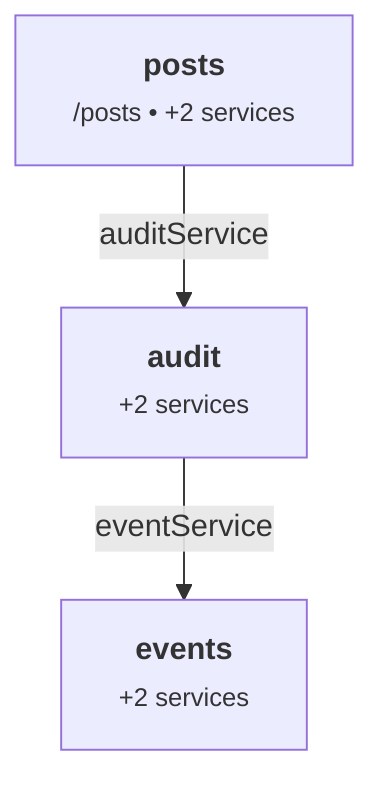

# Devtools

katajs ships a static module-graph inspector in the runtime — `inspectModules()` walks your app's modules and produces a JSON snapshot, a Mermaid graph source, or a self-contained HTML page. It's everything you need to *see* the structure of your app, today. A live interactive devtools UI ("Shape B") is on the v0.2 roadmap.

## What you get today: Shape A

```ts
import { inspectModules } from '@katajs/core';
import { postsModule } from '../src/modules/posts/index';
import { eventsModule } from '../src/modules/events/index';
import { auditModule } from '../src/modules/audit/index';

const insp = inspectModules([postsModule, eventsModule, auditModule]);

console.log(insp.modules);  // GraphModule[]
console.log(insp.edges);    // GraphEdge[]
console.log(insp.routes);   // GraphRoute[]
console.log(insp.mermaid()); // string — `graph TD ...`
console.log(insp.json());    // pretty-printed JSON
console.log(insp.html());    // full standalone HTML page
```

Pure, synchronous, build-time-safe. Runs in any Node-compatible environment — no Wrangler, no DB, no HTTP server.

## The shape of the data

Three arrays, each with a stable shape:

```ts
type GraphModule = {
  name: string;
  provides: string[];
  requires: string[];
  prefix?: string;       // present for routed modules
  hasRoutes: boolean;
};

type GraphEdge = {
  from: string;          // requiring module name
  to: string;            // providing module name
  via: string;           // the service key
};

type GraphRoute = {
  method: string;        // GET, POST, ...
  path: string;          // mounted at the module's prefix
  module: string;        // owning module name
};
```

The edges are computed by walking each module's `requires` array, looking up which other module `provides` that key, and emitting `from → to via key`. Self-edges (a module requiring something it also provides) are filtered out.

The route list dedupes Hono's internal entries — Hono's `app.routes` includes one entry per middleware in a route's chain (validators + handler), but the inspector reports each user-visible route once.

## The `pnpm graph` script

The scaffolder generates a `scripts/graph.ts` that runs the inspector and writes an HTML file:

```ts
// scripts/graph.ts (generated)
import { writeFileSync } from 'node:fs';
import { resolve } from 'node:path';
import { fileURLToPath } from 'node:url';
import { inspectModules } from '@katajs/core';

import { postsModule } from '../src/modules/posts/index';
// katajs:graph-imports

const modules = [
  postsModule,
  // katajs:graph-modules
];

const here = fileURLToPath(new URL('.', import.meta.url));
const out = resolve(here, '..', 'graph.html');

const insp = inspectModules(modules);
writeFileSync(out, insp.html({ title: 'my-app — module graph' }));
```

```jsonc
// package.json
"scripts": {
  "graph": "tsx scripts/graph.ts"
}
```

Run it whenever you want to refresh the snapshot:

```bash
pnpm graph
# ✓ wrote graph.html
#   5 modules • 4 dependencies • 9 routes
open graph.html
```

`katajs add module` updates the graph script's imports and modules array automatically (those `// katajs:graph-imports` and `// katajs:graph-modules` anchors), so the snapshot stays in sync as your app grows.

## What the HTML page looks like

The HTML includes:

- **Module graph** — a Mermaid `graph TD` rendered with dark theme. Each module is a node with its prefix and service count; edges are labeled with the service key being depended on.
- **Modules table** — name, prefix, provides (green pills), requires (blue pills).
- **Routes table** — method (color-coded), path (with module prefix merged), and owning module.

The page is self-contained — single HTML file, Mermaid loaded from a CDN. No build step. Open it in a browser, save it as a docs artifact, paste it into a Slack DM, whatever.

## Embedding the Mermaid graph elsewhere

`insp.mermaid()` returns the raw Mermaid source — useful for embedding in markdown docs (GitHub renders Mermaid natively in fenced code blocks):

````md

````

This is what makes graphing an architecture diagram a one-line script in a katajs project. Add it to your README or your design docs.

## Use cases

- **Reading a new module's deps quickly.** Run `pnpm graph` after pulling a branch — what cross-module dependencies were added?
- **Catching accidental coupling.** A leaf utility module with `requires: ['userService']` is suspicious; the graph makes it visible.
- **Onboarding.** A picture of "this is what the app looks like" beats reading a pile of `index.ts` files.
- **Design reviews.** Run `pnpm graph` on a feature branch, paste the HTML or Mermaid into the PR. "Here's the new dependency you're adding."
- **CI artifacts.** Generate `graph.html` as part of a build job; serve it from your docs site or attach it to releases.

## What Shape A doesn't give you (and Shape B will)

The static snapshot has limits:

- **Not interactive.** You can't click a module to see its services in detail; you read the table.
- **Not live.** It reflects whatever the source code looked like when you last ran `pnpm graph`.
- **No drill-down.** You can't click a service to see who resolves it from where.
- **No request flow.** You can't trace "this incoming request hits these routes, resolves these services, opens this transaction."

These are the things "Shape B" addresses — an interactive web UI shipped as `@katajs/devtools` (a separate dev-dependency package).

## Shape B preview (v0.2 roadmap)

The plan, as it stands:

- New package `@katajs/devtools`, dev-dependency-only.
- Stack: **Vite + React + TypeScript + Tailwind + shadcn/ui + React Flow (xyflow)**.
- CLI bin: `npx katajs-devtools` spawns a local server on `:4242`, opens browser.
- Two loader modes:
  1. **Static load** — imports the user's `modules` tuple at start, calls `inspectModules()`, hands JSON to UI. Same data Shape A produces, just rendered interactively.
  2. **Live mode** (fallback) — fetches from a `__katajs/graph.json` debug endpoint on the running Wrangler dev server. Updates as you edit code.
- UI panels: graph canvas with React Flow, module sidebar, drill-down detail drawer (provides/requires/routes/source-link), routes table with filtering, command palette (Cmd+K), Zod schema preview.
- No analytics, no telemetry, no remote anything — entirely local.

This is roughly a week of focused work and lands as a v0.2 milestone. The data contract is already defined by `Inspection` in `packages/core/src/inspect.ts` — the live UI just reads the same JSON.

## What's still on the roadmap beyond Shape B

- **Request tracing.** Show, for a given request, which routes matched, which services resolved, which transactions opened. Needs runtime instrumentation hooks in core.
- **Schema explorer.** Drill into a module's Zod schemas with example values rendered.
- **Dependency lint.** Static rules — "leaf modules can't require service modules", "circular DB deps are forbidden" — surfaced in the UI.
- **Time-travel.** Snapshot the graph at each commit; diff between branches.

These are post-1.0 ideas. Shape A and Shape B handle the immediate "see the structure" need.

## Summary

- `inspectModules(modules)` is a pure function you can call any time — at build, in a script, in a test.
- The scaffolder ships `scripts/graph.ts` + `pnpm graph` for a one-line snapshot to `graph.html`.
- Self-contained HTML page with Mermaid graph + modules and routes tables.
- Interactive devtools (Shape B) coming as `@katajs/devtools` in v0.2.
